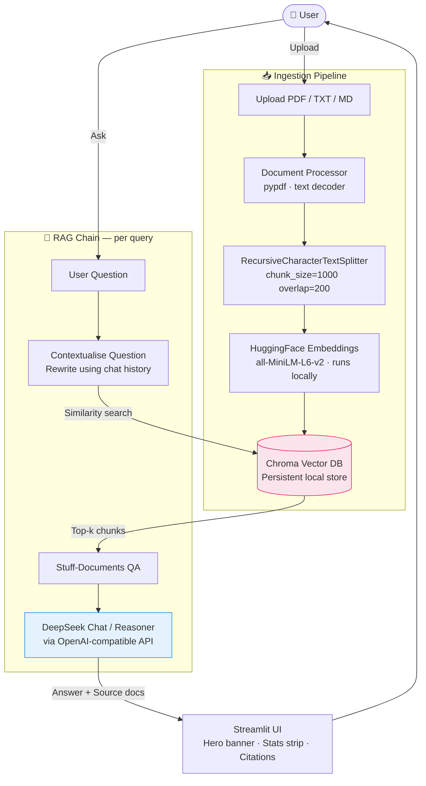

# 📚 Talk to Documents — RAG Assistant

A conversational AI that lets you **upload PDFs and text files** and ask questions in natural language. Answers are grounded in your documents and come with inline source citations. Conversation memory means follow-up questions work naturally.

> **Stack:** DeepSeek LLM · `all-MiniLM-L6-v2` local embeddings (free, no API) · Chroma vector DB · LangChain LCEL · Streamlit

---

## Architecture



### How it works

| Step | What happens |
|------|-------------|
| **Upload** | Files are decoded page-by-page (PDF) or as full text (TXT/MD) |
| **Chunk** | Each document is split into ~1 000-character overlapping chunks |
| **Embed** | Chunks are converted to vectors by `all-MiniLM-L6-v2` running **locally** — no API cost |
| **Retrieve** | The question is rewritten to be standalone, then the top-*k* most similar chunks are fetched |
| **Generate** | DeepSeek produces an answer grounded in the retrieved chunks |
| **Cite** | The UI surfaces the originating filename and page for every unique chunk used |

---

## Features

- **Multi-file upload** — PDF, TXT, Markdown in the same session
- **Free local embeddings** — `all-MiniLM-L6-v2` runs on your machine; zero embedding API cost
- **Persistent vector store** — Chroma persists to `./chroma_db/` so you don't re-embed on page reload
- **Conversation memory** — previous turns are passed to the retriever and LLM so follow-up questions work naturally
- **Source citations** — every answer surfaces deduplicated `(filename, page)` references with a text excerpt
- **Live stats strip** — shows document count, chunk count, active model, and turn count
- **Configurable** — swap model, temperature, and *k* from the sidebar without restarting

---

## Project Structure

```
rag-assistant/
├── app.py                      # Streamlit entry point
├── rag/
│   ├── __init__.py
│   ├── config.py               # Paths, model names, chunk settings
│   ├── document_processor.py   # PDF & text loaders + text splitter
│   ├── vectorstore.py          # Chroma VectorStoreManager
│   └── chain.py                # Conversational RAG chain (LCEL)
├── chroma_db/                  # Auto-created; gitignored
├── requirements.txt
├── .env.example
└── README.md
```

---

## Quick Start

### 1 — Prerequisites

- Python 3.10+
- A [DeepSeek API key](https://platform.deepseek.com/api_keys) (create a free account)

### 2 — Install

```bash
cd rag-assistant
python -m venv .venv
source .venv/bin/activate        # Windows: .venv\Scripts\activate
pip install -r requirements.txt
```

### 3 — Configure

```bash
cp .env.example .env
# Edit .env and set DEEPSEEK_API_KEY=sk-...
```

### 4 — Run

```bash
streamlit run app.py
```

The app opens at `http://localhost:8501`.

---

## Usage

1. **Upload** one or more PDF / TXT / Markdown files using the sidebar uploader.
2. Wait for the ingestion toast notifications — each file is chunked and embedded.
3. **Ask** any question in the chat input at the bottom.
4. Expand **"📎 N source(s) cited"** under any answer to see the originating document pages.
5. Ask follow-up questions — the assistant remembers the conversation.
6. Use **"🗑 Clear chat"** to start a new conversation without re-ingesting files.
7. Use **"🔄 Reset all"** to wipe the vector store and start completely fresh.

---

## Configuration

| Variable | Default | Description |
|----------|---------|-------------|
| `DEEPSEEK_API_KEY` | — | **Required.** Your DeepSeek secret key |
| `CHUNK_SIZE` | 1000 | Characters per chunk (`rag/config.py`) |
| `CHUNK_OVERLAP` | 200 | Overlap between consecutive chunks |
| `DEFAULT_LLM_MODEL` | `deepseek-chat` | LLM used for answering |
| `DEFAULT_EMBEDDING_MODEL` | `all-MiniLM-L6-v2` | Local HuggingFace embedding model |
| `NUM_RETRIEVED_DOCS` | 4 | Default *k* for similarity search |

> **Pinecone instead of Chroma?**
> Install `pinecone` and `langchain-pinecone`, set `PINECONE_API_KEY` + `PINECONE_INDEX_NAME` in `.env`, then replace `VectorStoreManager` in `rag/vectorstore.py` with a `PineconeVectorStore` wrapper using the same interface.

---

## Tech Stack

| Layer | Library |
|-------|---------|
| UI | [Streamlit](https://streamlit.io) |
| LLM | [DeepSeek](https://platform.deepseek.com) via [langchain-openai](https://python.langchain.com/docs/integrations/platforms/openai/) (OpenAI-compatible) |
| RAG orchestration | [LangChain](https://python.langchain.com) (LCEL) |
| Embeddings | [sentence-transformers](https://www.sbert.net) · `all-MiniLM-L6-v2` — **runs locally, free** |
| Vector store | [Chroma](https://www.trychroma.com) via [langchain-chroma](https://python.langchain.com/docs/integrations/vectorstores/chroma/) |
| PDF parsing | [pypdf](https://pypdf.readthedocs.io) |
